# Introduction(Puvee)

# Data Preprocessing with Exploratory Data Analysis (EDA)
## Load Libraries

```r
library(ggplot2)
library(dplyr)
library(scales)
library(grid)
library(tidyr)
library(rstudioapi)
library(tidyverse)
```

```
## Warning: package 'stringr' was built under R version 4.1.3
```

```r
library(lubridate,magrittr)
library(ggfortify)
```

```
## Warning: package 'ggfortify' was built under R version 4.1.3
```

```r
library(tseries)
```

```
## Warning: package 'tseries' was built under R version 4.1.3
```

```r
library('vars')
```

```
## Warning: package 'vars' was built under R version 4.1.3
```

```
## Warning: package 'strucchange' was built under R version 4.1.3
```

```
## Warning: package 'sandwich' was built under R version 4.1.3
```

```
## Warning: package 'urca' was built under R version 4.1.3
```

```r
library('quantmod')
library(LINselect)
```

```
## Warning: package 'LINselect' was built under R version 4.1.3
```

```r
library(forecast)
```

```
## Warning: package 'forecast' was built under R version 4.1.3
```

## Load Dataset
YLT: I changed this part, now u can just run and the path is set automatically

```r
main_dir<- dirname(dirname(rstudioapi::getSourceEditorContext()$path))
datadir<- paste0(main_dir,"/data")
data_path<- paste0(datadir,"/data.csv")

df=read.csv(data_path)
head(df)
```

```
##   stn_code      sampling_date          state  location agency
## 1      150 February - M021990 Andhra Pradesh Hyderabad   <NA>
## 2      151 February - M021990 Andhra Pradesh Hyderabad   <NA>
## 3      152 February - M021990 Andhra Pradesh Hyderabad   <NA>
## 4      150    March - M031990 Andhra Pradesh Hyderabad   <NA>
## 5      151    March - M031990 Andhra Pradesh Hyderabad   <NA>
## 6      152    March - M031990 Andhra Pradesh Hyderabad   <NA>
##                                 type so2  no2 rspm spm
## 1 Residential, Rural and other Areas 4.8 17.4   NA  NA
## 2                    Industrial Area 3.1  7.0   NA  NA
## 3 Residential, Rural and other Areas 6.2 28.5   NA  NA
## 4 Residential, Rural and other Areas 6.3 14.7   NA  NA
## 5                    Industrial Area 4.7  7.5   NA  NA
## 6 Residential, Rural and other Areas 6.4 25.7   NA  NA
##   location_monitoring_station pm2_5       date
## 1                        <NA>    NA 1990-02-01
## 2                        <NA>    NA 1990-02-01
## 3                        <NA>    NA 1990-02-01
## 4                        <NA>    NA 1990-03-01
## 5                        <NA>    NA 1990-03-01
## 6                        <NA>    NA 1990-03-01
```

## Explore Dataset

```r
str(df)
```

```
## 'data.frame':	435742 obs. of  13 variables:
##  $ stn_code                   : chr  "150" "151" "152" "150" ...
##  $ sampling_date              : chr  "February - M021990" "February - M021990" "February - M021990" "March - M031990" ...
##  $ state                      : chr  "Andhra Pradesh" "Andhra Pradesh" "Andhra Pradesh" "Andhra Pradesh" ...
##  $ location                   : chr  "Hyderabad" "Hyderabad" "Hyderabad" "Hyderabad" ...
##  $ agency                     : chr  NA NA NA NA ...
##  $ type                       : chr  "Residential, Rural and other Areas" "Industrial Area" "Residential, Rural and other Areas" "Residential, Rural and other Areas" ...
##  $ so2                        : num  4.8 3.1 6.2 6.3 4.7 6.4 5.4 4.7 4.2 4 ...
##  $ no2                        : num  17.4 7 28.5 14.7 7.5 25.7 17.1 8.7 23 8.9 ...
##  $ rspm                       : num  NA NA NA NA NA NA NA NA NA NA ...
##  $ spm                        : num  NA NA NA NA NA NA NA NA NA NA ...
##  $ location_monitoring_station: chr  NA NA NA NA ...
##  $ pm2_5                      : num  NA NA NA NA NA NA NA NA NA NA ...
##  $ date                       : chr  "1990-02-01" "1990-02-01" "1990-02-01" "1990-03-01" ...
```
There are 13 variables and 435742 row of observations in total.


```r
summary(df)
```

```
##    stn_code         sampling_date         state             location        
##  Length:435742      Length:435742      Length:435742      Length:435742     
##  Class :character   Class :character   Class :character   Class :character  
##  Mode  :character   Mode  :character   Mode  :character   Mode  :character  
##                                                                             
##                                                                             
##                                                                             
##                                                                             
##     agency              type                so2              no2        
##  Length:435742      Length:435742      Min.   :  0.00   Min.   :  0.00  
##  Class :character   Class :character   1st Qu.:  5.00   1st Qu.: 14.00  
##  Mode  :character   Mode  :character   Median :  8.00   Median : 22.00  
##                                        Mean   : 10.83   Mean   : 25.81  
##                                        3rd Qu.: 13.70   3rd Qu.: 32.20  
##                                        Max.   :909.00   Max.   :876.00  
##                                        NA's   :34646    NA's   :16233   
##       rspm             spm         location_monitoring_station     pm2_5       
##  Min.   :   0.0   Min.   :   0.0   Length:435742               Min.   :  3.0   
##  1st Qu.:  56.0   1st Qu.: 111.0   Class :character            1st Qu.: 24.0   
##  Median :  90.0   Median : 187.0   Mode  :character            Median : 32.0   
##  Mean   : 108.8   Mean   : 220.8                               Mean   : 40.8   
##  3rd Qu.: 142.0   3rd Qu.: 296.0                               3rd Qu.: 46.0   
##  Max.   :6307.0   Max.   :3380.0                               Max.   :504.0   
##  NA's   :40222    NA's   :237387                               NA's   :426428  
##      date          
##  Length:435742     
##  Class :character  
##  Mode  :character  
##                    
##                    
##                    
## 
```
Stn_code, sampling_date, state, location, agency, type, location_monitoring_station and date is labelled as character variables.

so2,no2,rspm,spm and pm2_5 are numerical variables with missing values.


## Drop Unnecessary Variables

Since "sampling_date" carry same meaning as "date", we may drop it. 

stn_code, location, agency and location_monitoring_station also seen carry same meaning with state, we may drop it too.

```r
df$sampling_date=NULL
df$stn_code=NULL
df$agency=NULL
df$location_monitoring_station=NULL
df$location=NULL
head(df)
```

```
##            state                               type so2  no2 rspm spm pm2_5
## 1 Andhra Pradesh Residential, Rural and other Areas 4.8 17.4   NA  NA    NA
## 2 Andhra Pradesh                    Industrial Area 3.1  7.0   NA  NA    NA
## 3 Andhra Pradesh Residential, Rural and other Areas 6.2 28.5   NA  NA    NA
## 4 Andhra Pradesh Residential, Rural and other Areas 6.3 14.7   NA  NA    NA
## 5 Andhra Pradesh                    Industrial Area 4.7  7.5   NA  NA    NA
## 6 Andhra Pradesh Residential, Rural and other Areas 6.4 25.7   NA  NA    NA
##         date
## 1 1990-02-01
## 2 1990-02-01
## 3 1990-02-01
## 4 1990-03-01
## 5 1990-03-01
## 6 1990-03-01
```


## Exploratary Data Analysis - Univariate  

Let's observe the other variables one by one. 

### Categorical variable - State

```r
plotdata <- df %>%
  count(state) %>%
  mutate(pct = n / sum(n),
         pctlabel = paste0(round(pct*100), "%"))
ggplot(plotdata, aes(x=reorder(state, n),y=pct)) +
  geom_bar(stat = "identity", fill = "lightgreen") +
  geom_text(aes(label = pctlabel), vjust = -0.25) +
  theme(axis.text.x = element_text(angle = 45, hjust = 1))+
  scale_y_continuous(labels = percent) +
  labs(y = "Percentage",x="State", title = "Percentage of Recording From Each State")
```


Maharashtra have most observations followed by Uttar Pradesh and others. 

### Categorical Variable - Type

```r
plotdata <- df %>%
  count(type) %>%
  mutate(pct = n / sum(n),
         pctlabel = paste0(round(pct*100), "%"))
ggplot(plotdata, aes(x = reorder(type, n), y=pct)) +
  geom_bar(stat = "identity", fill = "lightgreen") +
  geom_text(aes(label = pctlabel), vjust = -0.25) +
  theme(axis.text.x = element_text(angle = 45, hjust = 1))+
  scale_y_continuous(labels = percent) +
  labs(y = "Percentage", x="Area Type", title = "Percentage of Recording From Each Type of Area")
```


We can group the data into "residual", "industrial" and "others" class. 


```r
df$type[df$type %in% "Residential, Rural and other Areas"] <- "Residential"
df$type[df$type %in% "Residential and others"] <- "Residential"
df$type[df$type %in% "Industrial Area"] <- "Industrial"
df$type[df$type %in% "Industrial Areas"] <- "Industrial"
df$type[df$type %in% "RIRUO"] <- "Others"
df$type[df$type %in% "Sensitive"] <- "Others"
df$type[df$type %in% "Sensitive Areas"] <- "Others"
df$type[df$type %in% "Sensitive Area"] <- "Others"
df$type[is.na(df$type)]= "Others"
```


```r
plotdata <- df %>%
  count(type) %>%
  mutate(pct = n / sum(n),
         pctlabel = paste0(round(pct*100), "%"))

p1<-ggplot(plotdata, aes(x = reorder(type, n), y=pct)) +
  geom_bar(stat = "identity", fill = "lightgreen") +
  geom_text(aes(label = pctlabel), vjust = -0.25) +
  theme(axis.text.x = element_text(angle = 45, hjust = 1))+
  scale_y_continuous(labels = percent) +
  labs(y = "Percentage", x="Area Type", title = "Percentage of Recording From Each Type of Area")
p1
```


Now there is only 3 groups in area type.

### 4. Numerical Vairable - Sulfur dioxide (SO2), Nitrogen dioxide (nO2), Respirable Suspended Particulate Matter (rspm), Suspended particulate matter (spm), Fine particulate matter (pm2.5)

```r
plot1=ggplot(df, aes(x = so2)) +
  geom_histogram(binwidth=0.1, breaks= seq(0,100), colour="black", fill = "lightgreen")
plot2=ggplot(df, aes(x = no2)) +
  geom_histogram(binwidth=1, breaks= seq(0,200),colour="black", fill = "lightgreen")
plot3=ggplot(df, aes(x = rspm)) +
  geom_histogram(binwidth=100,  breaks= seq(0,500), fill = "lightgreen")
plot4=ggplot(df, aes(x = spm)) +
  geom_histogram(binwidth=100, breaks= seq(0,1000) ,fill = "lightgreen")
plot5=ggplot(df, aes(x = pm2_5)) +
  geom_histogram(binwidth=0.5, breaks= seq(0,300), colour="black", fill = "lightgreen")
grid.newpage()
vplayout <- function(x, y) viewport(layout.pos.row = x, layout.pos.col = y)
pushViewport(viewport(layout = grid.layout(5, 1)))
print(plot1, vp = vplayout(1, 1))
```

```
## Warning: Removed 34646 rows containing non-finite values (stat_bin).
```

```r
print(plot2, vp = vplayout(2, 1))
```

```
## Warning: Removed 16233 rows containing non-finite values (stat_bin).
```

```r
print(plot3, vp = vplayout(3, 1))
```

```
## Warning: Removed 40222 rows containing non-finite values (stat_bin).
```

```r
print(plot4, vp = vplayout(4, 1))
```

```
## Warning: Removed 237387 rows containing non-finite values (stat_bin).
```

```r
print(plot5, vp = vplayout(5, 1))
```

```
## Warning: Removed 426428 rows containing non-finite values (stat_bin).
```


There are 34646 rows of missing value in "so2", 16233 rows of missing value in “no2”, 40222 rows of missing value in “rspm”, 237387 rows of missing value in “spm”, 426428 rows of missing value in “pm2_5”.

We can observe that all so2, no2, rspm, spm and pm2_5 is right skewed, data scattered around lower value.


##  Create Subset

Because we want to build two models,

i) time series regression for predicting pm2.5 for year 2014 and 2015. 

ii) clustering using all data. 
so, we first make a subset for first model and clean it. 

### 1. Create Subset for Time Series Regression Model


```r
df_ts=subset(df, !is.na(pm2_5))
head(df_ts)
```

```
##                      state       type so2 no2 rspm spm pm2_5       date
## 65037 Dadra & Nagar Haveli Industrial  18  31  104  NA    35 2015-08-06
## 65038 Dadra & Nagar Haveli Industrial  14  26   94  NA    32 2015-08-10
## 65039 Dadra & Nagar Haveli Industrial  16  28   99  NA    35 2015-08-13
## 65040 Dadra & Nagar Haveli Industrial  13  23   82  NA    24 2015-08-20
## 65041 Dadra & Nagar Haveli Industrial  14  29   93  NA    32 2015-08-24
## 65042 Dadra & Nagar Haveli Industrial  13  25   77  NA    22 2015-08-26
```

```r
str(df_ts)
```

```
## 'data.frame':	9314 obs. of  8 variables:
##  $ state: chr  "Dadra & Nagar Haveli" "Dadra & Nagar Haveli" "Dadra & Nagar Haveli" "Dadra & Nagar Haveli" ...
##  $ type : chr  "Industrial" "Industrial" "Industrial" "Industrial" ...
##  $ so2  : num  18 14 16 13 14 13 12 15 14 16 ...
##  $ no2  : num  31 26 28 23 29 25 21 26 25 26 ...
##  $ rspm : num  104 94 99 82 93 77 81 90 89 100 ...
##  $ spm  : num  NA NA NA NA NA NA NA NA NA NA ...
##  $ pm2_5: num  35 32 35 24 32 22 27 29 27 34 ...
##  $ date : chr  "2015-08-06" "2015-08-10" "2015-08-13" "2015-08-20" ...
```

There is only 9314 rows that have pm2.5 value.  

### Cleaning Missing Values


```r
for(i in 1:8){
  x=sum(is.na(df_ts[i]))
  print(paste(names(df_ts[i]),x))}
```

```
## [1] "state 0"
## [1] "type 0"
## [1] "so2 119"
## [1] "no2 96"
## [1] "rspm 60"
## [1] "spm 9314"
## [1] "pm2_5 0"
## [1] "date 0"
```

so2,no2,rspm have missing values. spm is blank. 


```r
df_ts$so2[is.na(df_ts$so2)]= mean(df_ts$so2, na.rm = TRUE)
df_ts$no2[is.na(df_ts$no2)]= mean(df_ts$no2, na.rm = TRUE)
df_ts$rspm[is.na(df_ts$rspm)]= mean(df_ts$rspm, na.rm = TRUE)
df_ts$spm=NULL

for(i in 1:7){
  x=sum(is.na(df_ts[i]))
  print(paste(names(df_ts[i]),x))}
```

```
## [1] "state 0"
## [1] "type 0"
## [1] "so2 0"
## [1] "no2 0"
## [1] "rspm 0"
## [1] "pm2_5 0"
## [1] "date 0"
```

There is no missing value now and we can export this subset out for further enhancement such as visualization, modifications and modelling depending on the requirement of time series modelling. 


### Rearrange According To Date


```r
df_ts$date<-as.Date(df_ts$date, "%Y-%m-%d")
df_ts=df_ts[(order(df_ts$date,decreasing=FALSE)),]
```

### Export Subset 1


```r
#write.csv(df_ts,"data_ts.csv", row.names=FALSE)
```


### Time Series Plot 


```r
#check the data of noPmNA
table(df_ts$state)
```

```
## 
## Dadra & Nagar Haveli          Daman & Diu                Delhi 
##                   43                   44                  371 
##                  Goa              Gujarat       Madhya Pradesh 
##                 1390                 2401                  829 
##               Odisha           Tamil Nadu            Telangana 
##                 2788                  454                  354 
##          West Bengal 
##                  640
```


```r
#split the dataset
splitByState <- split(df_ts, df_ts$state)
str(splitByState)
```

```
## List of 10
##  $ Dadra & Nagar Haveli:'data.frame':	43 obs. of  7 variables:
##   ..$ state: chr [1:43] "Dadra & Nagar Haveli" "Dadra & Nagar Haveli" "Dadra & Nagar Haveli" "Dadra & Nagar Haveli" ...
##   ..$ type : chr [1:43] "Industrial" "Industrial" "Industrial" "Industrial" ...
##   ..$ so2  : num [1:43] 18 14 16 13 14 13 12 15 14 16 ...
##   ..$ no2  : num [1:43] 31 26 28 23 29 25 21 26 25 26 ...
##   ..$ rspm : num [1:43] 104 94 99 82 93 77 81 90 89 100 ...
##   ..$ pm2_5: num [1:43] 35 32 35 24 32 22 27 29 27 34 ...
##   ..$ date : Date[1:43], format: "2015-08-06" "2015-08-10" ...
##  $ Daman & Diu         :'data.frame':	44 obs. of  7 variables:
##   ..$ state: chr [1:44] "Daman & Diu" "Daman & Diu" "Daman & Diu" "Daman & Diu" ...
##   ..$ type : chr [1:44] "Industrial" "Industrial" "Industrial" "Industrial" ...
##   ..$ so2  : num [1:44] 12 14 14 12 13 14 13 12 13 14 ...
##   ..$ no2  : num [1:44] 22 24 26 21 23 25 22 21 23 25 ...
##   ..$ rspm : num [1:44] 94 90 73 81 76 89 93 87 87 89 ...
##   ..$ pm2_5: num [1:44] 30 28 23 22 28 27 30 26 29 28 ...
##   ..$ date : Date[1:44], format: "2015-08-06" "2015-08-10" ...
##  $ Delhi               :'data.frame':	371 obs. of  7 variables:
##   ..$ state: chr [1:371] "Delhi" "Delhi" "Delhi" "Delhi" ...
##   ..$ type : chr [1:371] "Industrial" "Residential" "Industrial" "Residential" ...
##   ..$ so2  : num [1:371] 4 4 4 4 4 4 4 4 4 4 ...
##   ..$ no2  : num [1:371] 67 35 55 51 61 47 38 65 57 61 ...
##   ..$ rspm : num [1:371] 397 221 250 192 289 143 171 344 197 425 ...
##   ..$ pm2_5: num [1:371] 110 141 155 86 151 62 139 163 126 147 ...
##   ..$ date : Date[1:371], format: "2015-01-01" "2015-01-05" ...
##  $ Goa                 :'data.frame':	1390 obs. of  7 variables:
##   ..$ state: chr [1:1390] "Goa" "Goa" "Goa" "Goa" ...
##   ..$ type : chr [1:1390] "Residential" "Residential" "Residential" "Residential" ...
##   ..$ so2  : num [1:1390] 4 5 9 4 4 15 4 4 5 4 ...
##   ..$ no2  : num [1:1390] 9 9 11 9 9 9 8 9 10 9 ...
##   ..$ rspm : num [1:1390] 70 94 72 60 68 77 44 77 88 63 ...
##   ..$ pm2_5: num [1:1390] 27 35 36 24 25 29 13 28 34 22 ...
##   ..$ date : Date[1:1390], format: "2015-01-02" "2015-01-02" ...
##  $ Gujarat             :'data.frame':	2401 obs. of  7 variables:
##   ..$ state: chr [1:2401] "Gujarat" "Gujarat" "Gujarat" "Gujarat" ...
##   ..$ type : chr [1:2401] "Residential" "Industrial" "Residential" "Residential" ...
##   ..$ so2  : num [1:2401] 19.5 15 14 12 13 ...
##   ..$ no2  : num [1:2401] 23 18.9 18 18 20 ...
##   ..$ rspm : num [1:2401] 88 73.3 65 67 67 ...
##   ..$ pm2_5: num [1:2401] 24 26 27 24 29 20 21 22 34 24 ...
##   ..$ date : Date[1:2401], format: "2014-01-04" "2014-01-05" ...
##  $ Madhya Pradesh      :'data.frame':	829 obs. of  7 variables:
##   ..$ state: chr [1:829] "Madhya Pradesh" "Madhya Pradesh" "Madhya Pradesh" "Madhya Pradesh" ...
##   ..$ type : chr [1:829] "Residential" "Industrial" "Industrial" "Residential" ...
##   ..$ so2  : num [1:829] 2 2 2 2 2 2 2 3 2 2 ...
##   ..$ no2  : num [1:829] 18 21 23 36 23 12 12 23 29 23 ...
##   ..$ rspm : num [1:829] 198 215 155 79 155 143 128 246 125 121 ...
##   ..$ pm2_5: num [1:829] 81 96 52 68 140 209 98 148 49 85 ...
##   ..$ date : Date[1:829], format: "2014-01-01" "2014-01-02" ...
##  $ Odisha              :'data.frame':	2788 obs. of  7 variables:
##   ..$ state: chr [1:2788] "Odisha" "Odisha" "Odisha" "Odisha" ...
##   ..$ type : chr [1:2788] "Residential" "Residential" "Residential" "Residential" ...
##   ..$ so2  : num [1:2788] 2 2 2 2 2 2 2 2 12 13 ...
##   ..$ no2  : num [1:2788] 37 34 29 25 30 24 14 24 11 12 ...
##   ..$ rspm : num [1:2788] 151 142 96 71 95 54 50 38 37 56 ...
##   ..$ pm2_5: num [1:2788] 95 82 60 48 43 35 14 21 18 22 ...
##   ..$ date : Date[1:2788], format: "2014-01-01" "2014-01-02" ...
##  $ Tamil Nadu          :'data.frame':	454 obs. of  7 variables:
##   ..$ state: chr [1:454] "Tamil Nadu" "Tamil Nadu" "Tamil Nadu" "Tamil Nadu" ...
##   ..$ type : chr [1:454] "Residential" "Industrial" "Residential" "Industrial" ...
##   ..$ so2  : num [1:454] 14 14 18 16 15 13 14 16 14 14 ...
##   ..$ no2  : num [1:454] 14 15 21 26 34 16 15 22 13 20 ...
##   ..$ rspm : num [1:454] 37 60 51 62 56 48 60 46 42 54 ...
##   ..$ pm2_5: num [1:454] 60 47 25 33.6 27 28 50 21 58 17 ...
##   ..$ date : Date[1:454], format: "2015-03-02" "2015-03-03" ...
##  $ Telangana           :'data.frame':	354 obs. of  7 variables:
##   ..$ state: chr [1:354] "Telangana" "Telangana" "Telangana" "Telangana" ...
##   ..$ type : chr [1:354] "Industrial" "Industrial" "Industrial" "Industrial" ...
##   ..$ so2  : num [1:354] 1.8 12.4 2.8 8.7 2 0.3 3.4 3.03 3.5 6.5 ...
##   ..$ no2  : num [1:354] 66.3 86.3 38.4 55.4 46.1 62.2 44.8 31.5 26.1 45.3 ...
##   ..$ rspm : num [1:354] 99 149 51 128 33 105 100 33 21 106 ...
##   ..$ pm2_5: num [1:354] 54 78 24 56 20 35 24 10 6 49 ...
##   ..$ date : Date[1:354], format: "2014-01-01" "2014-01-02" ...
##  $ West Bengal         :'data.frame':	640 obs. of  7 variables:
##   ..$ state: chr [1:640] "West Bengal" "West Bengal" "West Bengal" "West Bengal" ...
##   ..$ type : chr [1:640] "Residential" "Residential" "Others" "Industrial" ...
##   ..$ so2  : num [1:640] 10 7 2 3 7 9 7 12 9 10 ...
##   ..$ no2  : num [1:640] 40 57 46 54 58 69 69 40 71 74 ...
##   ..$ rspm : num [1:640] 138 82 77 104 86 93 214 132 217 92 ...
##   ..$ pm2_5: num [1:640] 83 52 36 47 60 63 94 76 109 48 ...
##   ..$ date : Date[1:640], format: "2015-01-02" "2015-01-02" ...
```


```r
library(ggplot2)

for (i in 1:length(splitByState)){
  loopdata<-splitByState[[i]]
  #print(loopdata)
  #print(as.character(names(splitByState[i])))
  #draw graph
  print(ggplot() +geom_line(data = loopdata,aes(x = date,y = pm2_5,colour = "pm2_5"),size=1) +
  geom_line(data = loopdata,aes(x = date,y = so2,colour = "so2"),size=1) +
  geom_line(data = loopdata,aes(x = date,y = no2,colour = "no2"),size=1) +
  geom_line(data = loopdata,aes(x = date,y = rspm,colour = "rspm"),size=1) +
  ggtitle(paste("State:",as.character(names(splitByState[i])))) +
  theme(plot.title = element_text(hjust = 0.5)) +
  scale_colour_manual("",values = c("pm2_5" = "red","so2"="green","no2"="blue","rspm"="yellow"))+
  xlab("Date")+ylab("Pollution"))
}
```

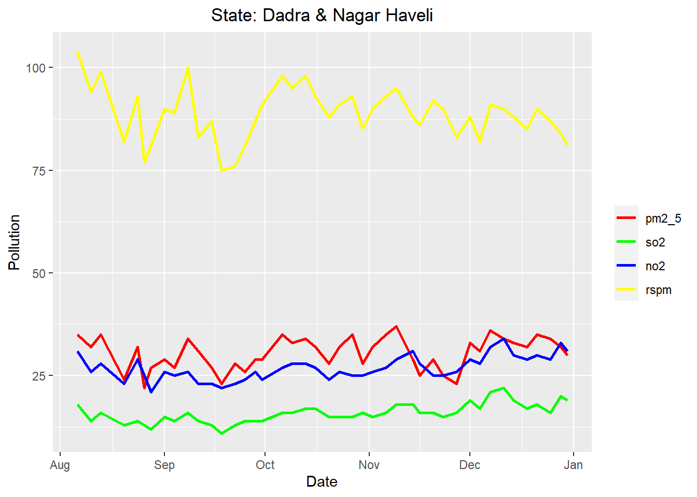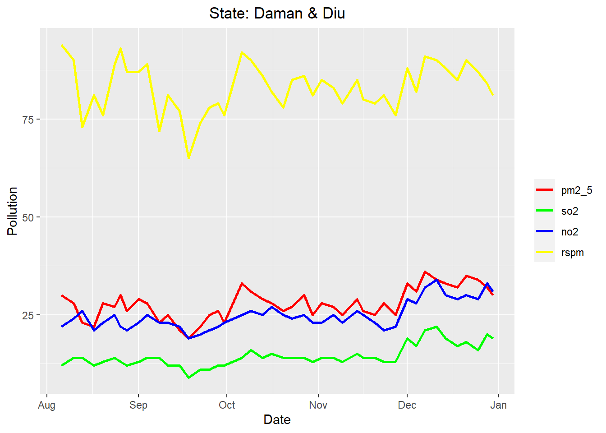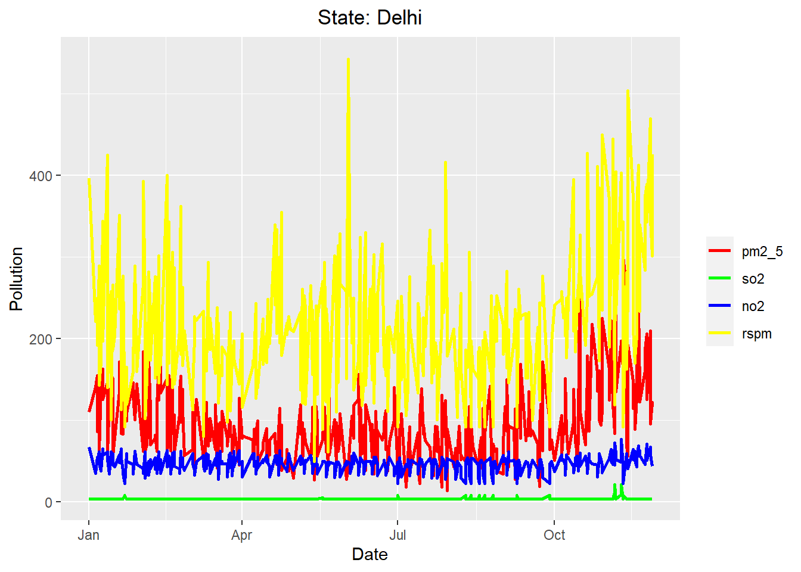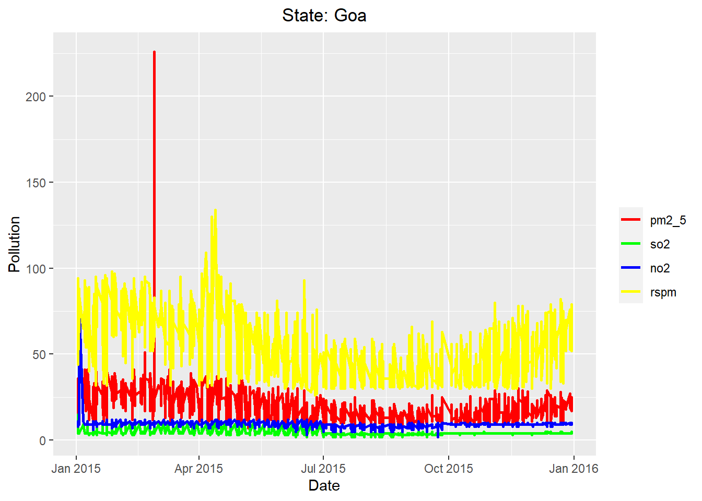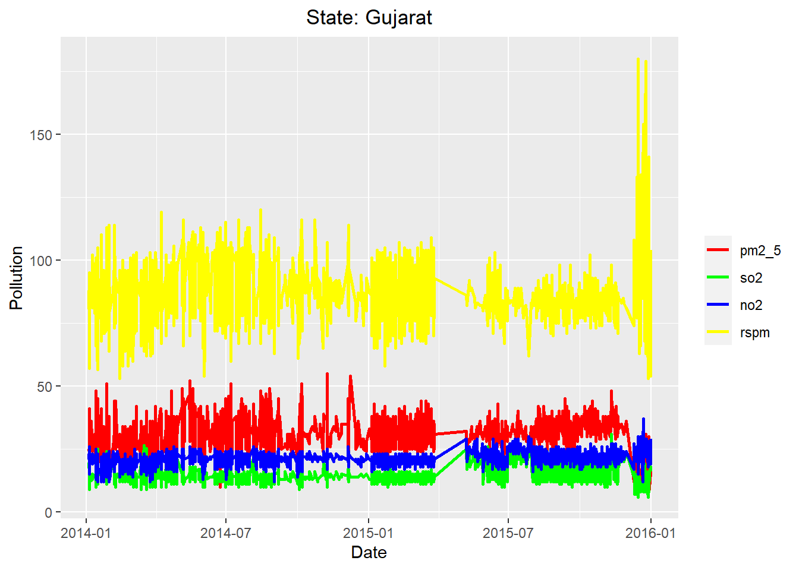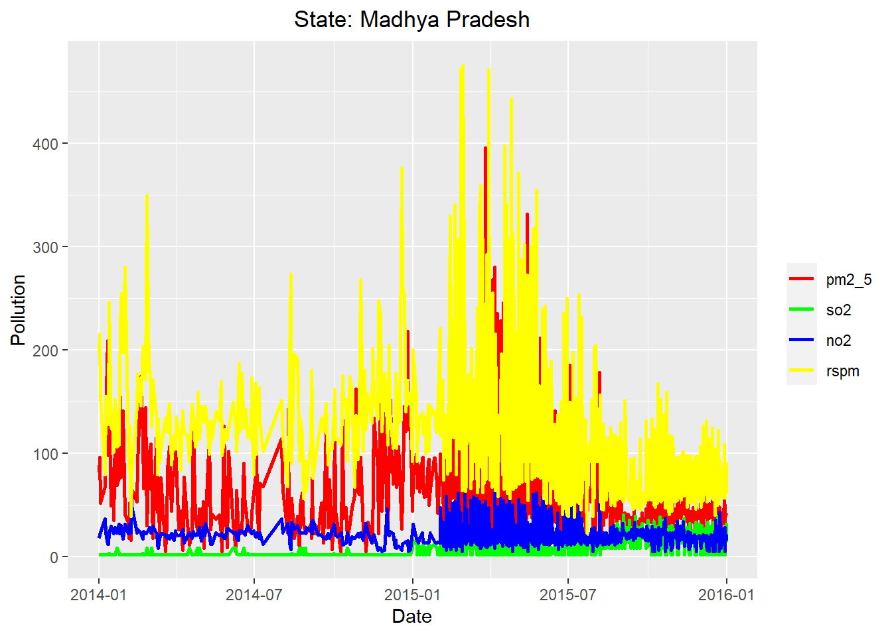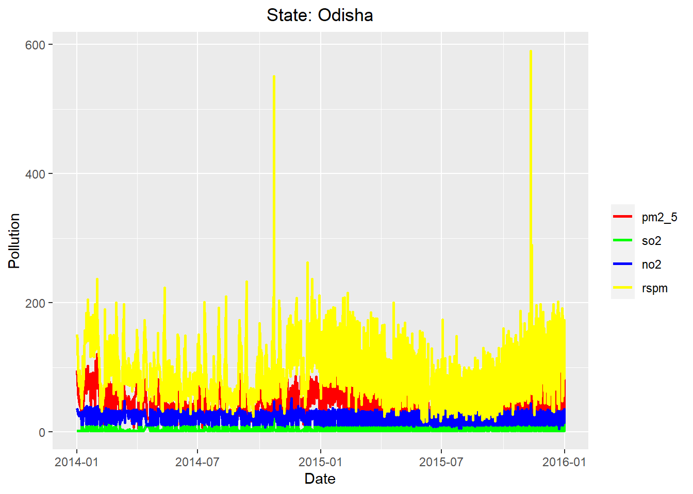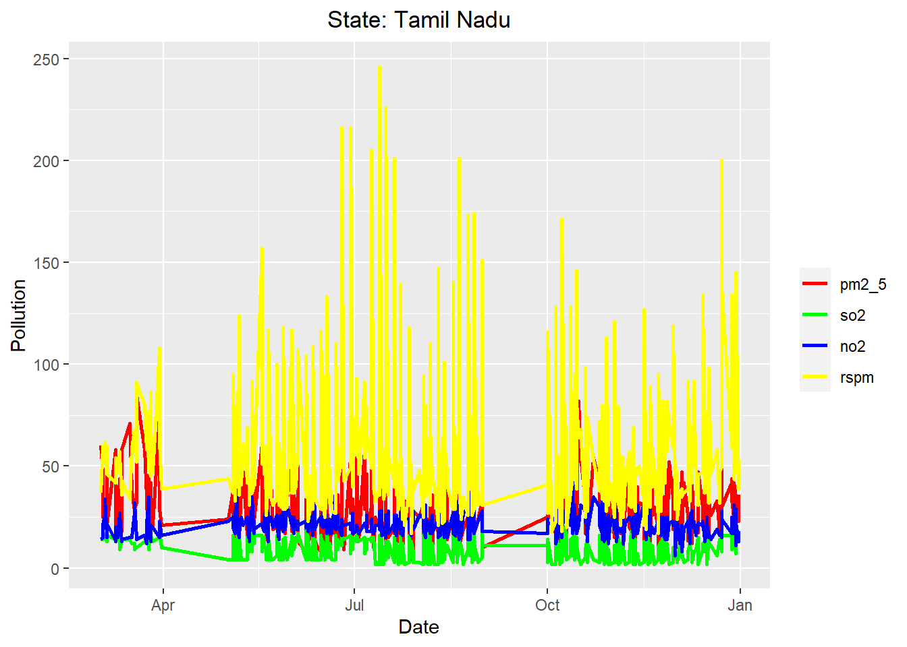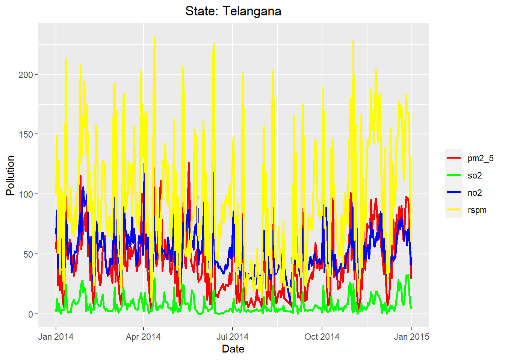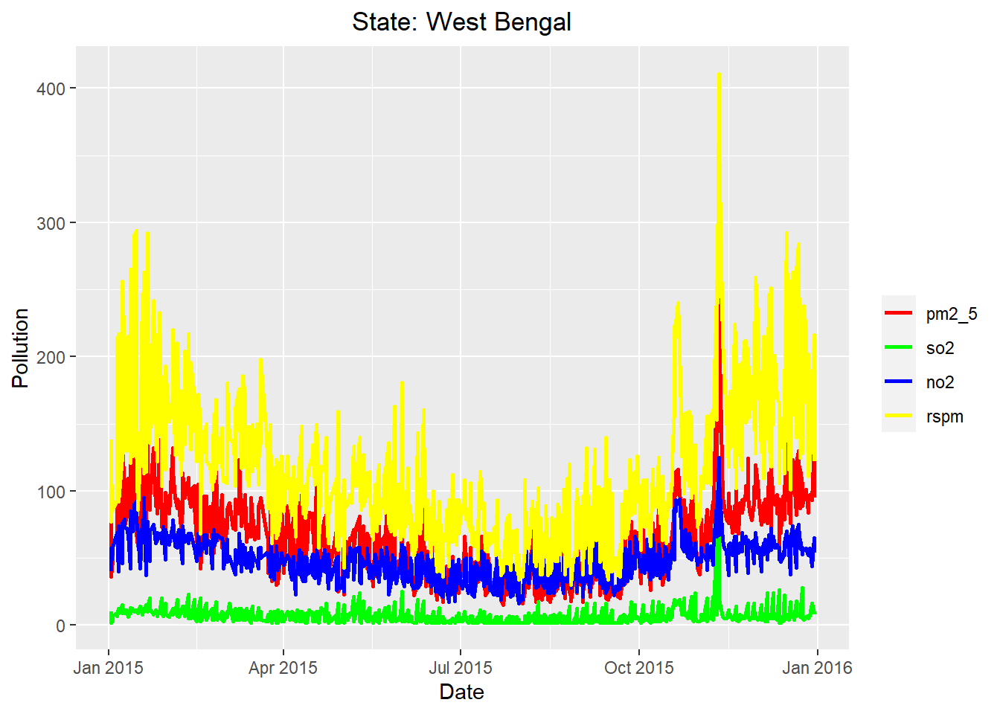

Since there are many states, location and type of development, we would like to focus on Madhya Pradesh regardless of location and type of development when conducting the time series modelling. We continue the data preparation for that purpose. 


```r
data = df_ts
```

Create a separate dataframe for state Madhya Pradesh.


```r
Madhya_Pradesh = data[which (data$state == 'Madhya Pradesh'), ] 
```

Remove other variables which are location and type

```r
Madhya_Pradesh = subset(data, select = -c(state,type))
```
Since there are repeating entries for the same date which may be due to  type, we group the date by mean.


```r
Madhya_Pradesh$day <- floor_date(Madhya_Pradesh$date, "day")
Madhya_Pradesh = aggregate(cbind(so2,no2,rspm,pm2_5) ~ day, data = Madhya_Pradesh, FUN = mean, na.rm = TRUE)
```

Create a train and test set (test set is set for 30 days) for modelling and validation purpose.

```r
MP_train= Madhya_Pradesh[1:697, ]
MP_train=subset(MP_train,select = -c(day))
MP_test= Madhya_Pradesh[698:727, ]
```

Using ts() to convert the dataframe into a time series object. To utilize ts(), we might have to calculate the day in number for ts().


```r
#as.numeric(as.Date("2014-01-01") - as.Date("2014-01-01"))
MP_train=ts(MP_train,start = c(2014,0),frequency = 365)
```

We replot the time series graph for training set of Madhya Pradesh.


```r
autoplot(MP_train) +
  ggtitle("Time Series Plot of the Madhaya Pradesh Time-Series") +
  theme(plot.title = element_text(hjust = 0.5))
```

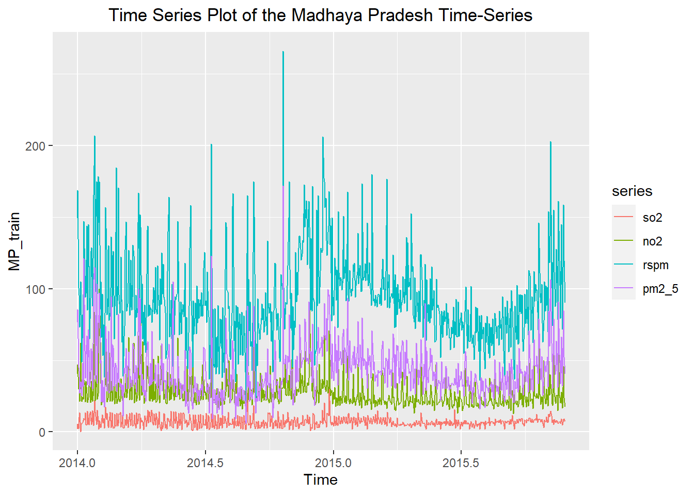


### 2. Create Subset for Clustering Model


```r
df_c=df
data_c_path = paste0(datadir, "/data_c.csv")

df_c$pm2_5=NULL
df_c$date=NULL
head(df_c)
```

```
##            state        type so2  no2 rspm spm
## 1 Andhra Pradesh Residential 4.8 17.4   NA  NA
## 2 Andhra Pradesh  Industrial 3.1  7.0   NA  NA
## 3 Andhra Pradesh Residential 6.2 28.5   NA  NA
## 4 Andhra Pradesh Residential 6.3 14.7   NA  NA
## 5 Andhra Pradesh  Industrial 4.7  7.5   NA  NA
## 6 Andhra Pradesh Residential 6.4 25.7   NA  NA
```

We dropped pm2.5 because it is the target variable and it is only available for last 2 year. 
We dropped date because clustering model no need time variable. 

### Cleaning Missing Values


```r
for(i in 1:6){
  x=sum(is.na(df_c[i]))
  print(paste(names(df_c[i]),x))}
```

```
## [1] "state 0"
## [1] "type 0"
## [1] "so2 34646"
## [1] "no2 16233"
## [1] "rspm 40222"
## [1] "spm 237387"
```

so2,no2,rspm and spm have missing values


```r
df_c$so2[is.na(df_c$so2)]= mean(df_c$so2, na.rm = TRUE)
df_c$no2[is.na(df_c$no2)]= mean(df_c$no2, na.rm = TRUE)
df_c$rspm[is.na(df_c$rspm)]= mean(df_c$rspm, na.rm = TRUE)
df_c$spm[is.na(df_c$spm)]= mean(df_c$spm, na.rm = TRUE)
df_c <- df_c %>% na.omit(df_c)

for(i in 1:6){
  x=sum(is.na(df_c[i]))
  print(paste(names(df_c[i]),x))}
```

```
## [1] "state 0"
## [1] "type 0"
## [1] "so2 0"
## [1] "no2 0"
## [1] "rspm 0"
## [1] "spm 0"
```

We mutate missing value in numerical variable using mean. 3 missing value for location, we just drop. 
There is no more missing values in the dataset, it is ready to export. 


```r
head(df_c)
```

```
##            state        type so2  no2     rspm      spm
## 1 Andhra Pradesh Residential 4.8 17.4 108.8328 220.7835
## 2 Andhra Pradesh  Industrial 3.1  7.0 108.8328 220.7835
## 3 Andhra Pradesh Residential 6.2 28.5 108.8328 220.7835
## 4 Andhra Pradesh Residential 6.3 14.7 108.8328 220.7835
## 5 Andhra Pradesh  Industrial 4.7  7.5 108.8328 220.7835
## 6 Andhra Pradesh Residential 6.4 25.7 108.8328 220.7835
```

```r
str(df_c)
```

```
## 'data.frame':	435742 obs. of  6 variables:
##  $ state: chr  "Andhra Pradesh" "Andhra Pradesh" "Andhra Pradesh" "Andhra Pradesh" ...
##  $ type : chr  "Residential" "Industrial" "Residential" "Residential" ...
##  $ so2  : num  4.8 3.1 6.2 6.3 4.7 6.4 5.4 4.7 4.2 4 ...
##  $ no2  : num  17.4 7 28.5 14.7 7.5 25.7 17.1 8.7 23 8.9 ...
##  $ rspm : num  109 109 109 109 109 ...
##  $ spm  : num  221 221 221 221 221 ...
```

### Export Subset 2


```r
#data_c_path = paste0(datadir, "/data_c.csv")
#write.csv(df_c, data_c_path, row.names=FALSE)
```


### Exploratory Data Analysis - Multivariate  

### 1. correlation
YLT: I commenting out this plot coz it takes too long to knit. Only include it back in final version.

```r
#pairs(~ so2 + no2 + rspm + spm, data=df_c, col = 'blue')
#plot(df_c)
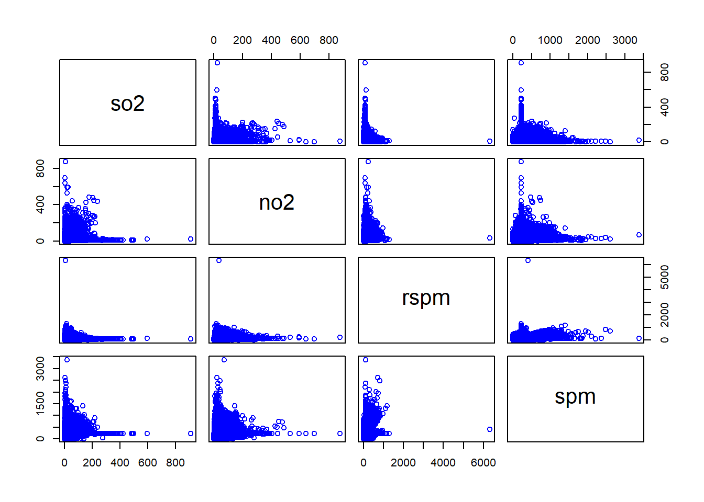
```


```r
knitr::include_graphics("plot correlation-2.png")
```


so2 and no2 seem to have slightly stronger positive relationship while the others variables seem like having poor relationship. 


### 2. Bivarite plot

#### Numerical variables with state

```r
plotdata <- df_c %>%
  group_by(state) %>%
  summarize(mean_1 = mean(so2))
ggplot(plotdata, aes(x = reorder(state, mean_1), y = mean_1)) +
  geom_bar(stat = "identity", fill = "cornflowerblue") +
  theme(axis.text.x = element_text(angle = 90, hjust = 1))+
  labs(title = "So2 by state", y = "Mean of SO2", x ="State")
```


```r
plotdata <- df_c %>%
  group_by(state) %>%
  summarize(mean_1 = mean(no2))
ggplot(plotdata, aes(x = reorder(state, mean_1), y = mean_1)) +
  geom_bar(stat = "identity", fill = "cornflowerblue") +
  theme(axis.text.x = element_text(angle = 90, hjust = 1))+
  labs(title = "No2 by state", y = "Mean of NO2", x ="State")
```


```r
plotdata <- df_c  %>%
  group_by(state) %>%
  summarize(mean_1 = mean(rspm))
ggplot(plotdata, aes(x = reorder(state, mean_1), y = mean_1)) +
  geom_bar(stat = "identity", fill = "cornflowerblue") +
  theme(axis.text.x = element_text(angle = 90, hjust = 1))+
  labs(title = "RSPM by state", y = "Mean of RSPM", x ="State")
```


```r
plotdata <- df_c  %>%
  group_by(state) %>%
  summarize(mean_1 = mean(spm))
ggplot(plotdata, aes(x = reorder(state, mean_1), y = mean_1)) +
  geom_bar(stat = "identity", fill = "cornflowerblue") +
  theme(axis.text.x = element_text(angle = 90, hjust = 1))+
  labs(title = "SPM by state", y = "Mean of SPM", x ="State")
```


Jharkhand have the highest SO2 concentration in the air. 
West Bengal have the highest NO2 concentration in the air.
Punjab have the highest RSPM index.
Delhi have the highest SPM index.

#### Numerical variables with type

```r
plotdata <- df_c %>%
  group_by(type) %>%
  summarize(mean_1 = mean(so2))
plot1=ggplot(plotdata, aes(x = reorder(type, mean_1), y = mean_1)) +
  geom_bar(stat = "identity", fill = "cornflowerblue") +
  theme(axis.text.x = element_text(angle = 45, hjust = 1))+
  labs(title = "So2 by area type", y = "Mean of SO2", x ="Area Type")

plotdata <- df_c %>%
  group_by(type) %>%
  summarize(mean_1 = mean(no2))
plot2=ggplot(plotdata, aes(x = reorder(type, mean_1), y = mean_1)) +
  geom_bar(stat = "identity", fill = "cornflowerblue") +
  theme(axis.text.x = element_text(angle = 45, hjust = 1))+
  labs(title = "No2 by area type", y = "Mean of NO2", x ="Area Type")

plotdata <- df_c %>%
  group_by(type) %>%
  summarize(mean_1 = mean(rspm))
plot3=ggplot(plotdata, aes(x = reorder(type, mean_1), y = mean_1)) +
  geom_bar(stat = "identity", fill = "cornflowerblue") +
  theme(axis.text.x = element_text(angle = 45, hjust = 1))+
  labs(title = "RSPM by area type", y = "Mean of RSPM", x ="Area Type")

plotdata <- df_c %>%
  group_by(type) %>%
  summarize(mean_1 = mean(spm))
plot4=ggplot(plotdata, aes(x = reorder(type, mean_1), y = mean_1)) +
  geom_bar(stat = "identity", fill = "cornflowerblue") +
  theme(axis.text.x = element_text(angle = 45, hjust = 1))+
  labs(title = "SPM by area type", y = "Mean of SPM", x ="Area Type")
grid.newpage()
pushViewport(viewport(layout = grid.layout(2, 2)))
print(plot1, vp = vplayout(1, 1))
print(plot2, vp = vplayout(1, 2))
print(plot3, vp = vplayout(2, 1))
print(plot4, vp = vplayout(2, 2))
```


Industrial area have highest So2 concentration, No2 concentration, RSPM index and SPM index. 


## Modelling & Results & Evaluation()
### Time series
####Since the dataset can be listed in a series of data points ordered in time, we decided to proceed with time series as our analysis. The independent variable is usually associated with time and the dependent variable is the target of the prediction. Due to the fact that there is more than one time-dependent variable, we will utilize the Multivariate Time series which the prediction not only depends on the past values but also dependent on other variables. 

First, we have to conduct the stationarity test as plotting a graph sometimes may not be adequate to determine whether the variables are stationary. We use Augmented Dickey-Fuller (ADF) Test in R to determine the stationarity of the data.

```r
apply(MP_train, 2, adf.test)
```

```
## Warning in FUN(newX[, i], ...): p-value smaller than printed p-value

## Warning in FUN(newX[, i], ...): p-value smaller than printed p-value

## Warning in FUN(newX[, i], ...): p-value smaller than printed p-value

## Warning in FUN(newX[, i], ...): p-value smaller than printed p-value
```

```
## $so2
## 
## 	Augmented Dickey-Fuller Test
## 
## data:  newX[, i]
## Dickey-Fuller = -6.7863, Lag order = 8, p-value = 0.01
## alternative hypothesis: stationary
## 
## 
## $no2
## 
## 	Augmented Dickey-Fuller Test
## 
## data:  newX[, i]
## Dickey-Fuller = -6.5562, Lag order = 8, p-value = 0.01
## alternative hypothesis: stationary
## 
## 
## $rspm
## 
## 	Augmented Dickey-Fuller Test
## 
## data:  newX[, i]
## Dickey-Fuller = -4.5431, Lag order = 8, p-value = 0.01
## alternative hypothesis: stationary
## 
## 
## $pm2_5
## 
## 	Augmented Dickey-Fuller Test
## 
## data:  newX[, i]
## Dickey-Fuller = -4.9314, Lag order = 8, p-value = 0.01
## alternative hypothesis: stationary
```

Since all data is stationary, we may proceed to modelling without differencing. We will utilize the Vector Autoregression model (VAR) to capture the relationship within a multivariate time series. Next, we will determine the lag p for the VAR(p) model. 


