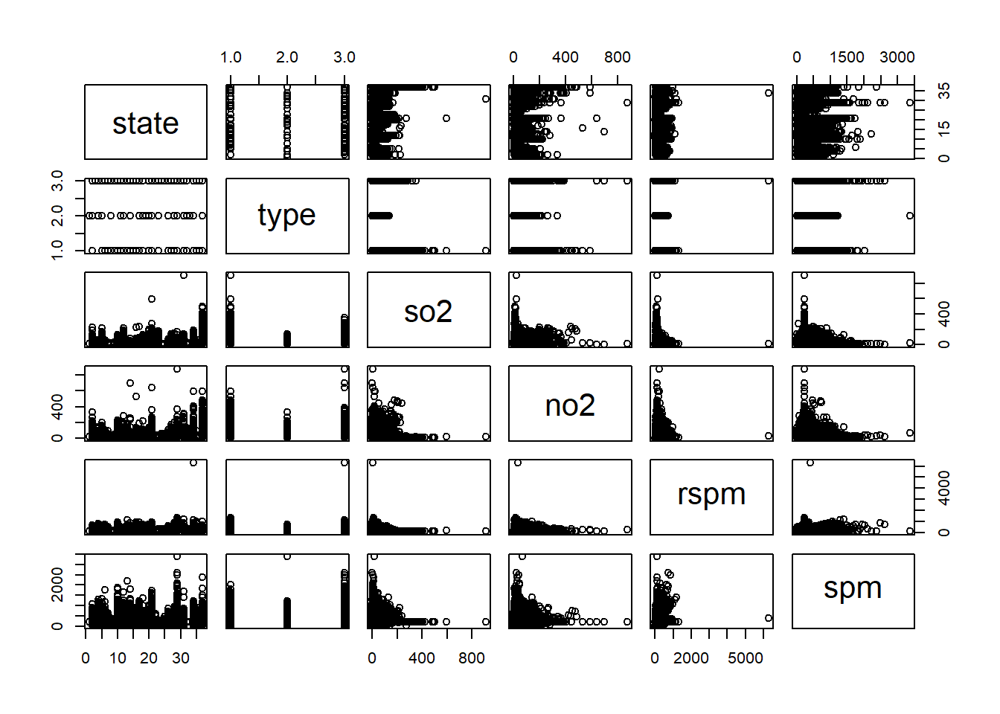

```{r setup, include=FALSE}
knitr::opts_chunk$set(echo = TRUE)
```

# Introduction(Puvee)

# Data Preprocessing with Exploratory Data Analysis (EDA)
## Load Libraries
```{r import library, message=FALSE}
library(ggplot2)
library(dplyr)
library(scales)
library(grid)
library(tidyr)
library(rstudioapi)
library(tidyverse)
library(lubridate,magrittr)
library(ggfortify)
library(tseries)
library('vars')
library('quantmod')
library(LINselect)
library(forecast)
```

## Load Dataset
YLT: I changed this part, now u can just run and the path is set automatically
```{r load dataset}
main_dir<- dirname(dirname(rstudioapi::getSourceEditorContext()$path))
datadir<- paste0(main_dir,"/data")
data_path<- paste0(datadir,"/data.csv")

df=read.csv(data_path)
head(df)
```

## Explore Dataset
```{r data set characteristics}
str(df)
```
There are 13 variables and 435742 row of observations in total.

```{r data set characteristics1}
summary(df)
```
Stn_code, sampling_date, state, location, agency, type, location_monitoring_station and date is labelled as character variables.

so2,no2,rspm,spm and pm2_5 are numerical variables with missing values.


## Drop Unnecessary Variables

Since "sampling_date" carry same meaning as "date", we may drop it. 

stn_code, location, agency and location_monitoring_station also seen carry same meaning with state, we may drop it too.
```{r drop sampling_date}
df$sampling_date=NULL
df$stn_code=NULL
df$agency=NULL
df$location_monitoring_station=NULL
head(df)
```


## Exploratary Data Analysis - Univariate  

Let's observe the other variables one by one. 

### Categorical variable - State
```{r plot state}
plotdata <- df %>%
  count(state) %>%
  mutate(pct = n / sum(n),
         pctlabel = paste0(round(pct*100), "%"))
ggplot(plotdata, aes(x=reorder(state, n),y=pct)) +
  geom_bar(stat = "identity", fill = "lightgreen") +
  geom_text(aes(label = pctlabel), vjust = -0.25) +
  theme(axis.text.x = element_text(angle = 45, hjust = 1))+
  scale_y_continuous(labels = percent) +
  labs(y = "Percentage",x="State", title = "Percentage of Recording From Each State")

```

Maharashtra have most observations followed by Uttar Pradesh and others. 

### Categorical variable - Location
```{r plot location}
plotdata <- df %>%
  count(location) %>%
  mutate(pct = n / sum(n),
         pctlabel = paste0(round(pct*100), "%")) %>%
  arrange(desc(n)) %>%
  head(10)
ggplot(plotdata, aes(x = reorder(location, n),y=pct)) +
  geom_bar(stat = "identity", fill = "lightgreen") +
  geom_text(aes(label = pctlabel), vjust = -0.25) +
  theme(axis.text.x = element_text(angle = 90, hjust = 1))+
  scale_y_continuous(labels = percent) +
  labs(y = "Percentage", title = "Percentage of Recording From Each Location")
```

Top 10 recording location is displayed. Guwahati have the highest percentage of recording. 


### Categorical Variable - Type
```{r plot Type}
plotdata <- df %>%
  count(type) %>%
  mutate(pct = n / sum(n),
         pctlabel = paste0(round(pct*100), "%"))
ggplot(plotdata, aes(x = reorder(type, n), y=pct)) +
  geom_bar(stat = "identity", fill = "lightgreen") +
  geom_text(aes(label = pctlabel), vjust = -0.25) +
  theme(axis.text.x = element_text(angle = 45, hjust = 1))+
  scale_y_continuous(labels = percent) +
  labs(y = "Percentage", x="Area Type", title = "Percentage of Recording From Each Type of Area")
```

We can group the data into "residual", "industrial" and "others" class. 

```{r plot Type1}
df$type[df$type %in% "Residential, Rural and other Areas"] <- "Residential"
df$type[df$type %in% "Residential and others"] <- "Residential"
df$type[df$type %in% "Industrial Area"] <- "Industrial"
df$type[df$type %in% "Industrial Areas"] <- "Industrial"
df$type[df$type %in% "RIRUO"] <- "Others"
df$type[df$type %in% "Sensitive"] <- "Others"
df$type[df$type %in% "Sensitive Areas"] <- "Others"
df$type[df$type %in% "Sensitive Area"] <- "Others"
df$type[is.na(df$type)]= "Others"
```


```{r plot Type2}
plotdata <- df %>%
  count(type) %>%
  mutate(pct = n / sum(n),
         pctlabel = paste0(round(pct*100), "%"))

p1<-ggplot(plotdata, aes(x = reorder(type, n), y=pct)) +
  geom_bar(stat = "identity", fill = "lightgreen") +
  geom_text(aes(label = pctlabel), vjust = -0.25) +
  theme(axis.text.x = element_text(angle = 45, hjust = 1))+
  scale_y_continuous(labels = percent) +
  labs(y = "Percentage", x="Area Type", title = "Percentage of Recording From Each Type of Area")
p1
```

Now there is only 3 groups in area type.

### 4. Numerical Vairable - Sulfur dioxide (SO2), Nitrogen dioxide (nO2), Respirable Suspended Particulate Matter (rspm), Suspended particulate matter (spm), Fine particulate matter (pm2.5)
```{r plot numeric}
plot1=ggplot(df, aes(x = so2)) +
  geom_histogram(binwidth=0.1, breaks= seq(0,100), colour="black", fill = "lightgreen")
plot2=ggplot(df, aes(x = no2)) +
  geom_histogram(binwidth=1, breaks= seq(0,200),colour="black", fill = "lightgreen")
plot3=ggplot(df, aes(x = rspm)) +
  geom_histogram(binwidth=100,  breaks= seq(0,500), fill = "lightgreen")
plot4=ggplot(df, aes(x = spm)) +
  geom_histogram(binwidth=100, breaks= seq(0,1000) ,fill = "lightgreen")
plot5=ggplot(df, aes(x = pm2_5)) +
  geom_histogram(binwidth=0.5, breaks= seq(0,300), colour="black", fill = "lightgreen")
grid.newpage()
vplayout <- function(x, y) viewport(layout.pos.row = x, layout.pos.col = y)
pushViewport(viewport(layout = grid.layout(5, 1)))
print(plot1, vp = vplayout(1, 1))
print(plot2, vp = vplayout(2, 1))
print(plot3, vp = vplayout(3, 1))
print(plot4, vp = vplayout(4, 1))
print(plot5, vp = vplayout(5, 1))
```

There are 34646 rows of missing value in "so2", 16233 rows of missing value in “no2”, 40222 rows of missing value in “rspm”, 237387 rows of missing value in “spm”, 426428 rows of missing value in “pm2_5”.

We can observe that all so2, no2, rspm, spm and pm2_5 is right skewed, data scattered around lower value.


##  Create Subset

Because we want to build two models,

i) time series regression for predicting pm2.5 for year 2014 and 2015. 

ii) clustering using all data. 
so, we first make a subset for first model and clean it. 

### 1. Create Subset for Time Series Regression Model

```{r plot subset1}
data=subset(df, !is.na(pm2_5))
head(data)
str(data)
```

There is only 9314 rows that have pm2.5 value.  

### Cleaning Missing Values

```{r plot subset missing value 1}
for(i in 1:9){
  x=sum(is.na(data[i]))
  print(paste(names(data[i]),x))}
```

so2,no2,rspm have missing values. spm is blank. 

```{r plot subset cleaning 1}
data$so2[is.na(data$so2)]= mean(data$so2, na.rm = TRUE)
data$no2[is.na(data$no2)]= mean(data$no2, na.rm = TRUE)
data$rspm[is.na(data$rspm)]= mean(data$rspm, na.rm = TRUE)
data$spm=NULL

for(i in 1:8){
  x=sum(is.na(data[i]))
  print(paste(names(data[i]),x))}
```

There is no missing value now and we can export this subset out for further enhancement such as visualization, modifications and modelling depending on the requirement of time series modelling. 


### Rearrange According To Date

```{r rearrange}
data$date<-as.Date(data$date, "%Y-%m-%d")
data=data[(order(data$date,decreasing=FALSE)),]
```

### Export Subset 1

```{r export subset1 csv}
#write.csv(data,"data_ts.csv", row.names=FALSE)
```


### Time Series Plot 

```{r}
#check the data of noPmNA
table(data$state)
```


```{r}
#split the dataset
splitByState <- split(data, data$state)
str(splitByState)
```

```{r}
library(ggplot2)

for (i in 1:length(splitByState)){
  loopdata<-splitByState[[i]]
  #print(loopdata)
  #print(as.character(names(splitByState[i])))
  #draw graph
  print(ggplot() +geom_line(data = loopdata,aes(x = date,y = pm2_5,colour = "pm2_5"),size=1) +
  geom_line(data = loopdata,aes(x = date,y = so2,colour = "so2"),size=1) +
  geom_line(data = loopdata,aes(x = date,y = no2,colour = "no2"),size=1) +
  geom_line(data = loopdata,aes(x = date,y = rspm,colour = "rspm"),size=1) +
  ggtitle(paste("State:",as.character(names(splitByState[i])))) +
  theme(plot.title = element_text(hjust = 0.5)) +
  scale_colour_manual("",values = c("pm2_5" = "red","so2"="green","no2"="blue","rspm"="yellow"))+
  xlab("Date")+ylab("Pollution"))
}


```

Since there are many states, location and type of development, we would like to focus on Madhya Pradesh regardless of location and type of development when conducting the time series modelling. We continue the data preparation for that purpose. 

so, create a separate dataframe for state Madhya Pradesh.

```{r}
Madhya_Pradesh = data[which (data$state == 'Madhya Pradesh'), ] 
```

Remove other variables which are location and type
```{r}
Madhya_Pradesh = subset(data, select = -c(state, location, type))
```
Since there are repeating entries for the same date which may be due to  type, we group the date by mean.

```{r}
Madhya_Pradesh$day <- floor_date(Madhya_Pradesh$date, "day")
Madhya_Pradesh = aggregate(cbind(so2,no2,rspm,pm2_5) ~ day, data = Madhya_Pradesh, FUN = mean, na.rm = TRUE)
```

Create a train and test set (test set is set for 30 days) for modelling and validation purpose.
```{r}
MP_train= Madhya_Pradesh[1:697, ]
MP_train=subset(MP_train,select = -c(day))
MP_test= Madhya_Pradesh[698:727, ]
```

Using ts() to convert the dataframe into a time series object. To utilize ts(), we might have to calculate the day in number for ts().

```{r}
#as.numeric(as.Date("2014-01-01") - as.Date("2014-01-01"))
MP_train=ts(MP_train,start = c(2014,0),frequency = 365)
```

We replot the time series graph for training set of Madhya Pradesh.

```{r}
autoplot(MP_train) +
  ggtitle("Time Series Plot of the Madhaya Pradesh Time-Series") +
  theme(plot.title = element_text(hjust = 0.5))
```


### 2. Create Subset for Clustering Model

```{r plot subset2}
df_c=df
data_c_path = paste0(datadir, "/data_c.csv")

df_c$pm2_5=NULL
df_c$date=NULL
head(df_c)
```

We dropped pm2.5 because it is the target variable and it is only available for last 2 year. 
We dropped date because clustering model no need time variable. 

### Cleaning Missing Values

```{r plot subset2 missing value 1}
for(i in 1:7){
  x=sum(is.na(df_c[i]))
  print(paste(names(df_c[i]),x))}
```

so2,no2,rspm and spm have missing values

```{r plot subset2 cleaning 1}
df_c$so2[is.na(df_c$so2)]= mean(df_c$so2, na.rm = TRUE)
df_c$no2[is.na(df_c$no2)]= mean(df_c$no2, na.rm = TRUE)
df_c$rspm[is.na(df_c$rspm)]= mean(df_c$rspm, na.rm = TRUE)
df_c$spm[is.na(df_c$spm)]= mean(df_c$spm, na.rm = TRUE)
df_c <- df_c %>% na.omit(df_c)

for(i in 1:7){
  x=sum(is.na(df_c[i]))
  print(paste(names(df_c[i]),x))}

```

We mutate missing value in numerical variable using mean. 3 missing value for location, we just drop. 
There is no more missing values in the dataset, it is ready to export. 

```{r subset2 stat}
head(df_c)
str(df_c)
```

### Export Subset 2

```{r export subset2 csv}
#data_c_path = paste0(datadir, "/data_c.csv")
#write.csv(df_c, data_c_path, row.names=FALSE)
```


### Exploratory Data Analysis - Multivariate  

### 1. correlation
```{r plot correlation}
#pairs(~ so2 + no2 + rspm + spm, data=df_c, col = 'blue')
#plot(df_c)
knitr::include_graphics("plot correlation-1.png")

```

so2 and no2 seem to have slightly positive relationship while the others variables seem like having poor relationship. 


### 2. Bivarite plot

#### Numerical variables with state
```{r plot so2 state}
plotdata <- df_c %>%
  group_by(state) %>%
  summarize(mean_1 = mean(so2))
ggplot(plotdata, aes(x = reorder(state, mean_1), y = mean_1)) +
  geom_bar(stat = "identity", fill = "cornflowerblue") +
  theme(axis.text.x = element_text(angle = 90, hjust = 1))+
  labs(title = "So2 by state", y = "Mean of SO2", x ="State")

plotdata <- df_c %>%
  group_by(state) %>%
  summarize(mean_1 = mean(no2))
ggplot(plotdata, aes(x = reorder(state, mean_1), y = mean_1)) +
  geom_bar(stat = "identity", fill = "cornflowerblue") +
  theme(axis.text.x = element_text(angle = 90, hjust = 1))+
  labs(title = "No2 by state", y = "Mean of NO2", x ="State")

plotdata <- df_c  %>%
  group_by(state) %>%
  summarize(mean_1 = mean(rspm))
ggplot(plotdata, aes(x = reorder(state, mean_1), y = mean_1)) +
  geom_bar(stat = "identity", fill = "cornflowerblue") +
  theme(axis.text.x = element_text(angle = 90, hjust = 1))+
  labs(title = "RSPM by state", y = "Mean of RSPM", x ="State")

plotdata <- df_c  %>%
  group_by(state) %>%
  summarize(mean_1 = mean(spm))
ggplot(plotdata, aes(x = reorder(state, mean_1), y = mean_1)) +
  geom_bar(stat = "identity", fill = "cornflowerblue") +
  theme(axis.text.x = element_text(angle = 90, hjust = 1))+
  labs(title = "SPM by state", y = "Mean of SPM", x ="State")

```

Jharkhand have the highest SO2 concentration in the air. 
West Bengal have the highest NO2 concentration in the air.
Punjab have the highest RSPM index.
Delhi have the highest SPM index.

#### Numerical variables with type
```{r plot so2 type}
plotdata <- df_c %>%
  group_by(type) %>%
  summarize(mean_1 = mean(so2))
plot1=ggplot(plotdata, aes(x = reorder(type, mean_1), y = mean_1)) +
  geom_bar(stat = "identity", fill = "cornflowerblue") +
  theme(axis.text.x = element_text(angle = 45, hjust = 1))+
  labs(title = "So2 by area type", y = "Mean of SO2", x ="Area Type")

plotdata <- df_c %>%
  group_by(type) %>%
  summarize(mean_1 = mean(no2))
plot2=ggplot(plotdata, aes(x = reorder(type, mean_1), y = mean_1)) +
  geom_bar(stat = "identity", fill = "cornflowerblue") +
  theme(axis.text.x = element_text(angle = 45, hjust = 1))+
  labs(title = "No2 by area type", y = "Mean of NO2", x ="Area Type")

plotdata <- df_c %>%
  group_by(type) %>%
  summarize(mean_1 = mean(rspm))
plot3=ggplot(plotdata, aes(x = reorder(type, mean_1), y = mean_1)) +
  geom_bar(stat = "identity", fill = "cornflowerblue") +
  theme(axis.text.x = element_text(angle = 45, hjust = 1))+
  labs(title = "RSPM by area type", y = "Mean of RSPM", x ="Area Type")

plotdata <- df_c %>%
  group_by(type) %>%
  summarize(mean_1 = mean(spm))
plot4=ggplot(plotdata, aes(x = reorder(type, mean_1), y = mean_1)) +
  geom_bar(stat = "identity", fill = "cornflowerblue") +
  theme(axis.text.x = element_text(angle = 45, hjust = 1))+
  labs(title = "SPM by area type", y = "Mean of SPM", x ="Area Type")
grid.newpage()
pushViewport(viewport(layout = grid.layout(2, 2)))
print(plot1, vp = vplayout(1, 1))
print(plot2, vp = vplayout(1, 2))
print(plot3, vp = vplayout(2, 1))
print(plot4, vp = vplayout(2, 2))

```

Industrial area have highest So2 concentration, No2 concentration, RSPM index and SPM index. 


## Modelling & Results & Evaluation()
### Time series
####Since the dataset can be listed in a series of data points ordered in time, we decided to proceed with time series as our analysis. The independent variable is usually associated with time and the dependent variable is the target of the prediction. Due to the fact that there is more than one time-dependent variable, we will utilize the Multivariate Time series which the prediction not only depends on the past values but also dependent on other variables. 

First, we have to conduct the stationarity test as plotting a graph sometimes may not be adequate to determine whether the variables are stationary. We use Augmented Dickey-Fuller (ADF) Test in R to determine the stationarity of the data.
```{r}
apply(MP_train, 2, adf.test)
```

Since all data is stationary, we may proceed to modelling without differencing. We will utilize the Vector Autoregression model (VAR) to capture the relationship within a multivariate time series. Next, we will determine the lag p for the VAR(p) model. 
```{r}
VARselect(MP_train, 
          type = "none", #type of deterministic regressors to include. We use none because the time series was made stationary using differencing above. 
          lag.max = 20) #highest lag order n= 10
```

The highest lag according to the lag selection is 10. We proceed by creating the model.
```{r}
var.a <- vars::VAR(MP_train,
                   lag.max = 10, #highest lag order for lag length selection according to the choosen ic
                   ic = "AIC", #information criterion
                   type = "none") #type of deterministic regressors to include
```

The result summaries of the VAR model fitting function. 
```{r}
summary(var.a)
```

We will use Granger test for causality where the null hypothesis is the lagged x-values do not explain the variation in y. In other words, it assumes that independent variable does not cause the dependent variable. All variable of multivariate time series have to be stationary for causality function to give reliable results.
```{r}
causality(var.a, #VAR model
          cause = c("pm2_5")) #dependent variable. If not specified then first column of x is used. Multiple variables can be used. 
```
The results shows that the null hypothesis is rejected and the independent variables can explain the PM 2.5.

Since the model is adequate, we proceed with forecasting and plot the forecast.
```{r}
fcast = predict(var.a, n.ahead =30) # we forecast over a month
par(mar = c(2.5,2.5,2.5,2.5))
plot(fcast)
```

We continue with evaluation.
```{r}
f.val= fcast$fcst$pm2_5[,1]
a.val= MP_test[['pm2_5']] # the accuracy requires numeric vector only. 
accuracy(f.val,a.val)
```

### Clustering
Besides time series modelling, we also do a clustering to identify cities (location) with similar air quality. We cluster them by using only the latest 1 year (2015-01-01 to 2015-12-31) of data, with the mean value of numerical variables (SO2, NO2, RSPM, SPM, PM2.5) as the features.

First we import relevant library. We then filter the recent data and obtain the features mentioned above:
```{r message=FALSE}
library(cluster)
library(lubridate)

start_date<- ymd("2015-01-01")
rec_clus_data<- df[df$date > start_date, ]

### remove rows with missing location
rec_clus_data<- rec_clus_data[!is.na(rec_clus_data$location), ]

loc_data<- rec_clus_data %>% group_by(location) %>%
  summarise(mean_so2 = mean(so2, na.rm=TRUE),
            mean_no2 = mean(no2, na.rm=TRUE),
            mean_rspm = mean(rspm, na.rm=TRUE),
            mean_spm = mean(spm, na.rm=TRUE),
            mean_pm2_5 = mean(pm2_5, na.rm=TRUE)
  ) %>% data.frame()

head(loc_data)
```
Next we check and handle the missing values.
```{r}
num_loc = nrow(loc_data)

for (col in colnames(loc_data) ){
  num_na<- sum(is.na(loc_data[col]))
  perc_na<- round(100*num_na/num_loc, digits=2)
  print(paste(col, num_na, perc_na))
}
```

We see that SPM (100%) and PM2.5 (75.2%) have very large amount of missing values. We can only drop these features as imputing them will introduce large bias in the clustering model. \n
For SO2 and NO2, we will impute using mean value.

```{r}
loc_data$mean_so2[is.na(loc_data$mean_so2)]= mean(loc_data$mean_so2, na.rm = TRUE)
loc_data$mean_no2[is.na(loc_data$mean_no2)]= mean(loc_data$mean_no2, na.rm = TRUE)

#### set location as row names
rownames(loc_data)<- loc_data$location

#### drop unnecessary columns
clean_loc_data<- loc_data %>% select(-c(mean_spm, mean_pm2_5, location))

head(clean_loc_data)
```

Before clustering the data, we need to scale the features so that their magnitude are of the same order.

```{r}
scaled_loc_data<- clean_loc_data
for (mean_col in colnames(scaled_loc_data)){
 scaled_loc_data[mean_col]<- scale(scaled_loc_data[mean_col], center=TRUE, scale=TRUE)
}
```

Now we can do clustering. We use the elbow method to obtain a suitable number of clusters, k.

```{r}
max_k<- 20
wcss<- rep(NA, max_k-1)

for (k in c(2:max_k)){
  k_clus<- kmeans(scaled_loc_data, centers = k, nstart = 10)
  wcss[k-1]<- k_clus$tot.withinss
}

wcss_df<- data.frame(k=c(2:max_k), wcss = wcss)
wcss_fig<- wcss_df %>% ggplot(aes(x=k, y=wcss)) + 
  geom_line() + geom_point()

print(wcss_fig)
```

Here, we see that at around k=8 the Within Cluster Sum of Squared (WCSS) value decreases slowly. Thus we will pick optimal k as 8 to do the clustering.

```{r}
best_k<- 8

clus_loc<- kmeans(scaled_loc_data, centers = scaled_loc_data[1:best_k,], nstart = 10)
clus_grp<- data.frame(clus_loc$cluster) %>% setNames("cluster")
merged_res<- merge(clean_loc_data, clus_grp, by ='row.names', all=TRUE)
merged_res$cluster<- as.factor(merged_res$cluster)

### center of each cluster
center_data<- merged_res %>% group_by(cluster) %>%
  summarise(num_city = n(),
            cen_mean_so2 = mean(mean_so2, na.rm=TRUE),
            cen_mean_no2 = mean(mean_no2, na.rm=TRUE),
            cen_mean_rspm = mean(mean_rspm, na.rm=TRUE),
  ) %>% data.frame()

print(center_data)
```

The above table shows the centroid for each cluster. To better visualise the difference among the clusters, we can plot the box plot of each features for the clusters:

```{r}
clus_vis_so2<- merged_res %>% ggplot(aes(x=cluster, y=mean_so2)) +
  geom_boxplot()
print(clus_vis_so2)

clus_vis_no2<- merged_res %>% ggplot(aes(x=cluster, y=mean_no2)) +
  geom_boxplot()
print(clus_vis_no2)

clus_vis_rspm<- merged_res %>% ggplot(aes(x=cluster, y=mean_rspm)) +
  geom_boxplot()
print(clus_vis_rspm)
```

From the plot, we see that cities in cluster 6, 7 and 8 have high values in all 3 features, which represents low air quality. Interestingly, these clusters have significantly high value in exactly 1 of the feature: cluster 6 is high in RSPM, cluster 7 in SO2 and cluster 8 in NO2.
For the others, cities in cluster 5 have the best air quality with lowest value in all 3 features. Cluster 2, 3, 4 have moderate value in all 3 features while cluster 1 has moderate value in SO2 and NO2 but with high RSPM.

## Discussion ()

Note that the `echo = FALSE` parameter was added to the code chunk to prevent printing of the R code that generated the plot.
## Conclusion (Puvee)